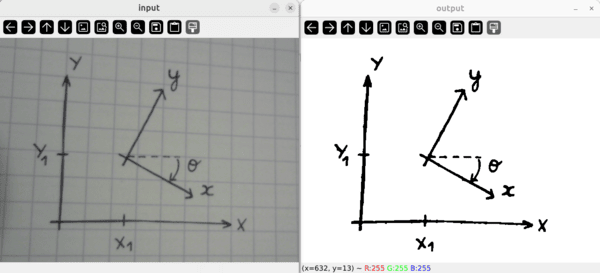

# scan_drawing2png
Scan a drawing using a webcam. For adding quick and dirty images from handmade drawings to illustrate concepts (diagram, charts, mechanical model, etc.)

## Requirements
NumPy, OpenCV

## Usage
A live feed allows to adjust the camera position

  

Then pressing 's' saves the current image, it changes its background to transparent, crops it, and resize it to fit the desired image width (variable `DESIRED_WIDTH`).

## TODO
- Automatic color detection to apply a specific RGB color code for different colors (red, green, blue, black, gray).

